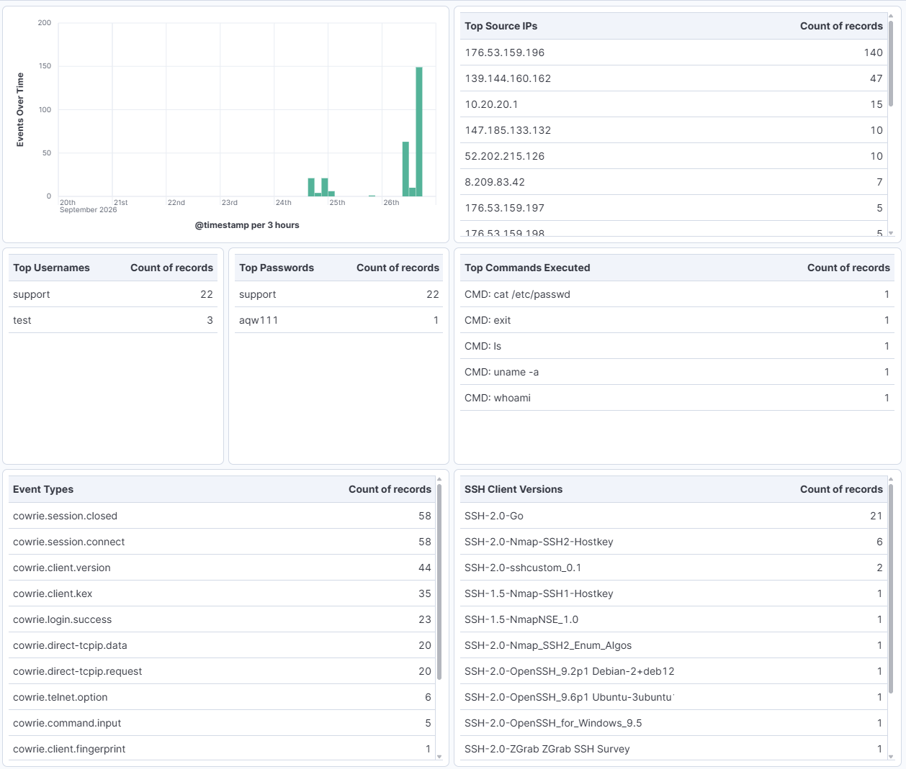
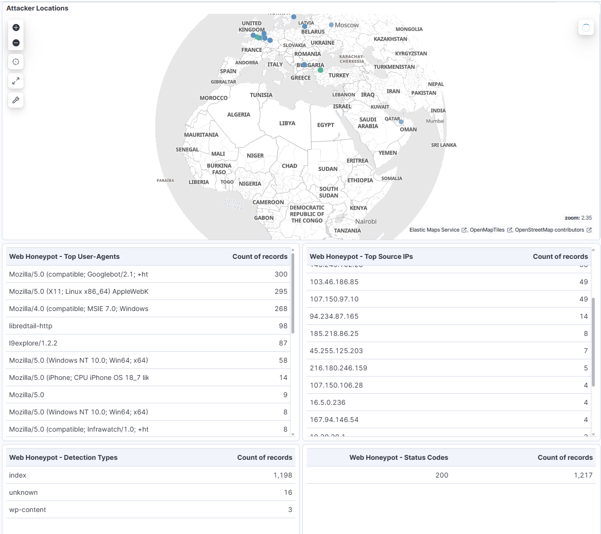

# pfSense + ELK Honeypot Lab

A segmented home lab combining pfSense, a Cowrie SSH/Telnet honeypot, a
SNARE + TANNER web honeypot, and the ELK stack (Elasticsearch,
Logstash, Kibana) - built to practice network segmentation, firewall
rule design, and SOC-style log analysis against real internet traffic.

## Overview

The lab exposes two deliberately isolated honeypots to the public
internet via port forwarding - one for SSH/Telnet, one for web
traffic - captures every interaction in structured JSON logs, ships
them through a Filebeat -> Logstash -> Elasticsearch pipeline enriched
with GeoIP data, and visualizes activity in a Kibana dashboard. The
web honeypot additionally classifies incoming requests automatically
(e.g. SQL injection, XSS, generic recon) via TANNER, rather than
relying on manual log inspection alone.

## Architecture

Three segmented networks behind pfSense:

* **WAN** - bridged to the home network, real internet access
* **DMZ** (10.20.20.0/24) - both honeypots only, outbound traffic
locked to HTTP/HTTPS + DNS to pfSense, no path to the management
network
* **MGMT** (10.20.30.0/24) - the ELK stack, reachable from DMZ only on
the single port needed for log shipping (5044)

Full network design: [docs/architecture.md](docs/architecture.md)

## Components

|Component|Details|
|-|-|
|[pfSense](docs/pfsense.md)|Firewall/router, interface segmentation, NAT rules, port forwarding|
|[Honeypot](docs/honeypot.md)|Cowrie (SSH + Telnet), medium-interaction, JSON session logging|
|[Web Honeypot](docs/web-honeypot.md)|SNARE + TANNER, cloned decoy site, automatic attack classification|
|[ELK Stack](docs/elk-stack.md)|Log pipeline, GeoIP enrichment, Kibana dashboard|

## Dashboard

Events over time, source IPs, credentials and commands attempted,
web request paths and detection types, and attacker locations on a
map - built in Kibana Lens and Maps, covering both honeypots.

## Investigations

Notable activity captured after exposing the honeypots to the internet
is documented in [investigations/](investigations/), one write-up per
session - source, behavior, and a MITRE ATT\&CK mapping where applicable.

## Status

Live since 2026-09-24, actively receiving internet traffic on both
honeypots.

