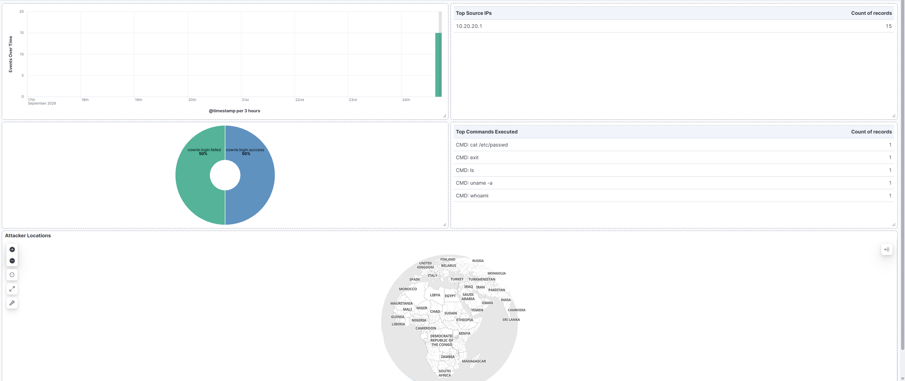

# pfSense + ELK Honeypot Lab

A segmented home lab combining pfSense, a Cowrie SSH/Telnet honeypot, and

the ELK stack (Elasticsearch, Logstash, Kibana) - built to practice

network segmentation, firewall rule design, and SOC-style log analysis

against real internet traffic.

## Overview

The lab exposes a deliberately isolated honeypot to the public internet

via port forwarding, captures every interaction in structured JSON logs,

ships them through a Filebeat -> Logstash -> Elasticsearch pipeline

enriched with GeoIP data, and visualizes activity in a Kibana dashboard.

## Architecture

Three segmented networks behind pfSense:

- **WAN** - bridged to the home network, real internet access

- **DMZ** (10.20.20.0/24) - the honeypot only, outbound traffic locked

  to HTTP/HTTPS + DNS to pfSense, no path to the management network

- **MGMT** (10.20.30.0/24) - the ELK stack, reachable from DMZ only on

  the single port needed for log shipping (5044)

Full network design: [docs/architecture.md](docs/architecture.md)

## Components

| Component | Details |

|---|---|

| [pfSense](docs/pfsense.md) | Firewall/router, interface segmentation, NAT rules, port forwarding |

| [Honeypot](docs/honeypot.md) | Cowrie (SSH + Telnet), medium-interaction, JSON session logging |

| [ELK Stack](docs/elk-stack.md) | Log pipeline, GeoIP enrichment, Kibana dashboard |

## Dashboard

Events over time, source IPs, commands executed, login outcomes, and

attacker locations on a map - built in Kibana Lens and Maps.

## Investigations

Notable activity captured after exposing the honeypot to the internet

is documented in [investigations/](investigations/), one write-up per

session - source, behavior, and a MITRE ATT&CK mapping where applicable.

## Status

Live since 2026-09-24, actively receiving internet traffic.
